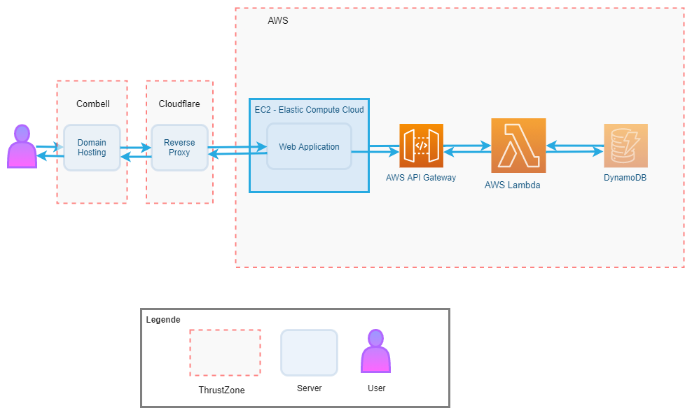

  

# The DogShop by The Unicorns :unicorn:

- [Goal](#Goal)
- [Acceptance criteria](#Acceptance-criteria)
  - [User stories](#User-stories)
  - [Security](#Security)
    - [Website](#Website)
    - [API](#API)
    - [Database](#Database)
- [Threat model](#Threat-model)
- [Deployment](#Deployment)
- [Handy dev links](#Handy-dev-links)

## Goal

Het creëren van een dynamische website voor een vzw die zich bezighoud met het adopteren van honden/puppy's.
Deze website bevat enkele statische pagina's voor informatie rond de vzw zelf. Maar er zijn ook dynamishe pagina's beschikbaar, namelijk één voor het bekijken van de honden en ook een om een afspraak te maken om de hond te gaan bezoeken. Er zal ook een User Management systeem aan gekoppeld zijn, zodat mensen een account kunnen aanmaken en kunnen inloggen op de website. Enkel de Administrator zal honden kunnen toevoegen of verwijderen en zal alle afspraken kunnen bekijken.

Om deze website te maken, gaan we gebruik maken van het web framework Laravel en de hierbij horende database. Indien nodig zal er ook gebruikt gemaakt worden van een externe API (zelfgeschreven).
In de database zullen de gegevens van de gebruikers en de honden terug te vinden zijn.

Indien mogelijk zouden we alles in de cloud laten draaien: bv. web hosting via Combell, api hosting via AWS amplify (of ec2) en database hosting via aws of azure.

## Acceptance criteria

### User stories

- Als een bezoeker kan ik informatie lezen over de vzw.
- Als een bezoeker kan ik kijken welke honden voor adoptie openstaan.
- Als een bezoeker kan ik mij registreren om lid te worden van de website.
- Als lid kan ik mij inloggen op mijn account.
- Als lid kan ik mijn profielpagina wijzigen.
- Als lid kan ik een afspraak maken om de hond te gaan bezoeken.
- Als lid kan ik een hond adopteren.
- Als lid kan ik mij uitloggen.
- Als admin kan ik informatie over de vzw wijzigen.
- Als admin kan ik nieuwe honden toevoegen.
- Als admin kan ik honden verwijderen wanneer deze zijn geadopteerd.
- Als admin heb ik toegang tot alle afspraken.
- Als admin heb ik toegang tot de database van alle leden.
- Als admin heb ik toegang tot de database van alle honden.

### Security

#### Website

- CSRF tokens
- SQL Injection protection
- HTTPS
- [SSL Labs](https://www.ssllabs.com/ssltest/analyze.html?d=desideriushogeschool.be) rating van A+

#### API

- API tokens
- Inkomende JSON controleren voor gebruik
- Stuurt status code terug

#### Database

- Alle data bewaren aan de hand van de GDPR regels
- Wachtwoorden encrypten
- Enkel noodzakelijke informatie bijhouden
- Data dat aangemaakt is door een user die het recht tot gegevenswissing heeft aangeroepen, manipuleren zodat de aangemaakte data kan blijven bestaan. Dit gebeurt door de hand van het updaten van de tussentabel naar een standaard 'verwijderde user'.

## Threat model

### Uitleg diagram
We vertrekken vanuit de eindgebruik: Onze webapp wordt publiek op het internet beschikbaar gesteld door gebruik te maken van volgende services:

#### Combell 
Ons product maakt gebruik van de domein hosting service van combell.

#### Cloudflare
Het product maakt gebruik van de reverse proxy service van Cloudflare.
Ook handeld dit een deel van de security requirements af namelijk:
- End to end encryption a.d.h.v. SSL certificaat
- Minimum TLS 1.2
- HSTS
- Altijd HTTPS gebruiken
- Bescherming tegen DDOS aanvallen
- Access control list
- Toegang weigeren voor bots

Daarnaast wordt de webapp gehost op een EC2 instantie binnen de AWS trust boundary. Deze webapp zal zijn benodigde data verzamelen door gebruik te maken van een API. Dit proces bevindt zich volledig binnen de AWS trust boundary afspelen.

OWASP:
  Name |Bedreiging | Oplossing |Plaats
  ---| ---| ---| ---
  Broken Access Control | De toegang verlenen voor onbevoegden op de componenten | Alle componenten afschermen aan de hand van authenticatie & authorisatie | De webapp
  Cryptographic Failures | Het niet beveiligen van gevoelige data | Gevoelige data encrypteren en enkel data opslagen die noodzakelijk is | Dit wordt binnen heel het threat diagram toegepast.
  Injection | Malafide data dat geïnjecteerd wordt | Valideren van data aan de server-side kant aan de hand van een vertrouwde API | De webapp
  Insecure Design | Fouten blootleggen door een slechte architectuur | De applicatie opbouwen in modules | De webapp
  Security Misconfiguration | Het misconfigureren van componenten zodat iedereen toegang heeft | Alle niet noodzakelijke poorten sluiten | De EC2 instantie
  Vulnerable and Outdated Components | Outdated documentatie en/of dependencies blijven gebruiken | Documentatie updaten + niet noodzakelijke dingen verwijderen + gebruik maken van GitHub Dependabot | De webapp + GitHub
  Identification and Authentication Failures | Identicatie en autorisatie niet afschermen | Login & registratie beveiligen aan de hand van bestaande frameworks + controleren op zwakke wachtwoorden | De webapp
  Software and Data Integrity Failures | Het gebruiken van malafide software plug-ins | Het is cruciaal dat de CI/CD pipelines afgescheiden zijn van elkaar en dat zowel de ACL’s als de pipelines zelf correct geconfigureerd zijn. Gebruik maken van de Dependabot die de dependencies up-to-date houdt en ook waarschuwt wanneer er een malafide dependencies gebruikt wordt. Code wordt geschreven op aparte branches. Bij een pull request wordt de code nagekeken door een teamlid en ook door enlightn | De webapp + GitHub + Enlightn
  Security Logging and Monitoring Failures | Het niet loggen van activiteiten | Cruciale activiteiten loggen m.b.v. o.a. Laravel/Telescope | De webapp

Andere security maatregels:
  - De pagina’s die enkele toegankelijk zijn voor administrators zijn extra beveiligd door de gebruiker nog eens zijn/haar wachtwoord in te doen geven.
  - 2FA
  - GDPR
  - Werken met verschillende rollen binnen de webapp (AuthZ)
  - Maximum aantal inlogpogingen

## Deployment

*minimally, this section contains a public URL of the app. A description of how your software is deployed is a bonus. Do you do this manually, or did you manage to automate? Have you taken into account the security of your deployment process?*

## *you may want further sections*

*especially if the use of your application is not self-evident*

## Handy dev links

- [Trello](https://trello.com/b/k9sE6Qd0/dogshop)
- [Canvas](https://ehb.instructure.com/courses/22745/assignments)
- [GitHub](https://github.com/EHB-TI/web-app-unicorns)
- [Website](https://desideriushogeschool.be)
